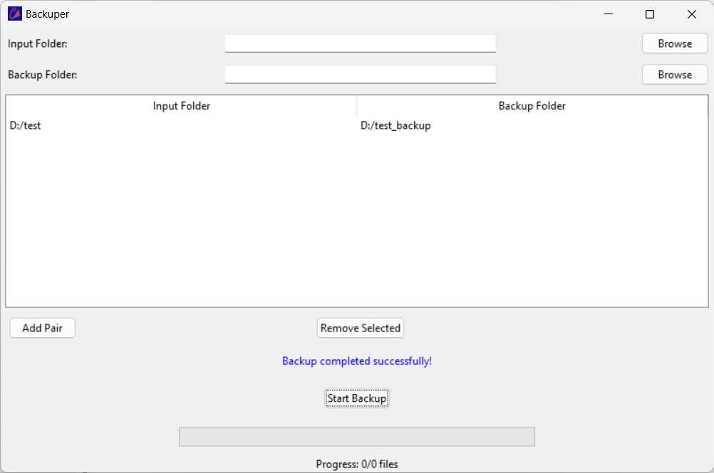

# Backuper

A simple and efficient tool to manage automatic backups for your files and folders.

<!-- 
## Installation

1. Extract the ZIP file available [here](TODO: Provide the download link).
2. Launch `backuper.exe`.
 -->
## Manual Installation

1. Install [Python](https://www.python.org/downloads/) (version 3.6 or higher).
2. Run `setup.ps1` in PowerShell to set up the environment and build the application
3. Launch backuper.exe

## Features

- **Backup Management**: Easily create and manage backup pairs of input and destination folders.
- **Automated Reminders**: Get notified when it's time to back up files, ensuring you stay up-to-date.
- **Progress Tracking**: View real-time progress of files being backed up, including estimated time remaining.

## Issues

If you encounter any issues or have suggestions for improvements, please submit them to the GitHub issue tracker for this project.
